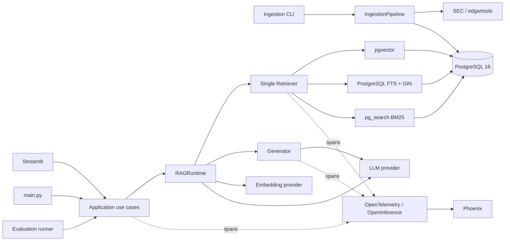
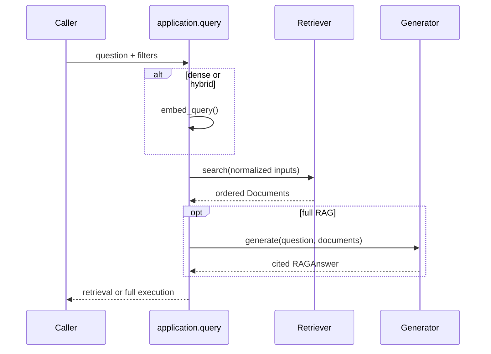
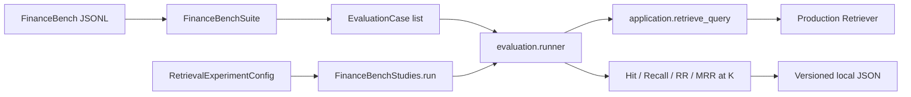

# FinNexus — Current Architecture and Evaluation Context

This document describes the repository after the retrieval/evaluation refactor.
The current code is the source of truth. Historical evaluation artifacts may
describe older implementations and must not be interpreted as the active
architecture.

## 1. Purpose and implemented interfaces

FinNexus ingests SEC EDGAR filings, chunks and embeds their sections, stores the
result in PostgreSQL, retrieves evidence for financial questions, and optionally
generates a cited answer with an LLM.

Implemented user interfaces:

- `rag-sec-ingest`: ingestion CLI;
- `main.py`: small command-line RAG example;
- `streamlit_app.py`: interactive ingestion, filing browser, and question UI;
- `python -m rag_sec.evaluation.cli`: FinanceBench retrieval evaluation.

There is no FastAPI, REST, GraphQL, or other network API layer. Query rewriting,
query analysis, reranking, multi-filing reasoning, and background job processing
are not implemented production stages.

## 2. Technology stack

- Python 3.12 and `uv`;
- PostgreSQL 16 through `paradedb/paradedb:0.25.3-pg16`;
- pgvector for dense retrieval;
- pg_search 0.25.3 for PostgreSQL-native BM25;
- SQLAlchemy async and asyncpg;
- edgartools for SEC filing access;
- LangChain Core, PostgreSQL, OpenAI, Hugging Face, and Ollama integrations;
- OpenAI, Hugging Face, or Ollama embeddings selected by environment variables;
- OpenAI, Hugging Face, or Ollama chat models selected independently;
- Streamlit;
- Phoenix, OpenTelemetry, and OpenInference tracing;
- structlog;
- pytest, Ruff, and Mypy.

Docker Compose starts PostgreSQL/ParadeDB and Phoenix. PostgreSQL persists in the
`finexus_pgdata` volume. `pg_search` is preloaded and both `vector` and
`pg_search` extensions are created by database initialization.

## 3. Important repository structure

```text
.
├── main.py                         # CLI query example
├── streamlit_app.py                # Streamlit entrypoint
├── docker-compose.yml              # PostgreSQL/ParadeDB and Phoenix
├── scripts/
│   ├── prepare_financebench_corpus.py
│   └── evaluate_financebench.py    # dense compatibility wrapper
└── src/rag_sec/
    ├── application/
    │   ├── runtime.py              # lazy process lifecycle and warmup
    │   ├── query.py                # retrieval-only and full RAG execution
    │   └── filings.py              # filing listing use case
    ├── cli/ingest.py               # ingestion CLI
    ├── config.py                   # environment-backed settings
    ├── database/                   # manager and persistence repositories
    ├── evaluation/                 # dataset adapter, runner, metrics, CLI
    ├── generation/                 # context, prompting, citations, usage
    ├── ingestion/                  # EDGAR ingestion pipeline
    ├── models/                     # SQLAlchemy ORM models
    ├── prompts/generation/         # tracked Markdown prompt resources
    ├── providers/                  # embedding and chat provider factories
    ├── retrieval/                  # dense, FTS, BM25, and RRF
    ├── schemas/                    # Pydantic domain schemas
    ├── ui/service.py               # Streamlit-facing application service
    ├── logging.py
    └── observability.py
```

`docs/`, `notebooks/`, `tests/`, and `data/` are intentionally ignored at the
current project stage. Evaluation artifacts therefore remain local and are not
committed.

## 4. High-level architecture



## 5. Configuration model

`src/rag_sec/config.py` uses Pydantic Settings and `.env`. Embedding and LLM
providers are independent.

Embedding selection:

```dotenv
EMBEDDING_PROVIDER=openai # openai | huggingface | ollama
EMBEDDING_OPENAI_MODEL_NAME=text-embedding-3-small
EMBEDDING_OPENAI_DIMENSION=1536
```

Retrieval selection:

```dotenv
RETRIEVAL_MODE=hybrid             # dense | fts | bm25 | hybrid
RETRIEVAL_TOP_K=5
RETRIEVAL_DENSE_CANDIDATE_K=20
RETRIEVAL_FTS_CANDIDATE_K=20
RETRIEVAL_BM25_CANDIDATE_K=20
RETRIEVAL_HYBRID_LEXICAL_BACKEND=fts # fts | bm25
RETRIEVAL_RRF_K=60
RETRIEVAL_DENSE_WEIGHT=1.0
RETRIEVAL_LEXICAL_WEIGHT=1.0
```

The embedding provider, model, and dimension form a compatibility profile.
Retrieval only considers active processing versions matching that profile. A
provider or dimension change therefore requires a compatible ingestion; it does
not silently reuse incompatible vectors.

## 6. Runtime lifecycle

`RAGRuntime` owns lazy cached properties for the database, embedding model,
Retriever, and Generator.

- Importing the package does not initialize external services.
- `warmup_retrieval()` initializes the database, warms the embedding model, and
  constructs the pgvector store.
- `warmup()` additionally constructs the Generator.
- repeated warmups are protected by an async lock and readiness flags;
- `shutdown()` closes database connections and resets readiness.

The Streamlit service caches the runtime across reruns. Normal query execution
does not reconstruct the database manager, Retriever, embedding model, or LLM.

## 7. Query workflow

`application/query.py` exposes two levels:

1. `retrieve_query()` resolves the configured retrieval mode, computes a query
   embedding only if the selected mode contains a dense branch, calls the real
   Retriever, and returns documents plus embedding/retrieval latencies.
2. `execute_query()` calls `retrieve_query()`, passes its documents to the
   Generator, and returns the answer, documents, token usage, throughput, and
   stage latencies.

`answer_query()` is the simpler public full-RAG interface used by Streamlit and
`main.py`.



FTS and BM25 queries have `embedding_latency_ms = 0` per request. Dense and
hybrid queries require an embedding.

## 8. Retrieval architecture

There is one public `Retriever`. It normalizes all modes to LangChain
`Document` objects and applies the same active-version and filing filters.

### Dense

Dense search uses `PGVectorStore.asimilarity_search_by_vector()` against the
`active_chunks` view. It filters by embedding provider, model, dimension,
ticker, form type, and accession number.

### PostgreSQL FTS

`PostgresFTSStore` uses:

- `to_tsvector('pg_catalog.english', chunks.text)`;
- disjunctive `websearch_to_tsquery` parsing for natural-language questions;
- `ts_rank_cd` ranking;
- expression GIN index `ix_chunks_text_fts_english`;
- active processing-version, embedding-profile, and filing filters.

The GIN index was verified with `EXPLAIN` during the refactor.

### pg_search BM25

`BM25Store` queries PostgreSQL through pg_search. The index
`ix_chunks_text_bm25` indexes chunk ID, text, filing ID, and processing-version
ID, with chunk ID as the key field. BM25 scoring, tokenization, IDF, and document
normalization happen inside PostgreSQL/Tantivy; Python implements none of them.

Search uses two SQL stages because joined pg_search ranking produced an
unsupported-node error:

1. resolve active processing-version IDs under filing/company/profile filters;
2. query the indexed chunks table with those IDs.

`EXPLAIN` confirmed a ParadeDB Base Scan with the version filter pushed down.

### Hybrid and RRF

Hybrid mode runs dense and the configured lexical branch concurrently with
`asyncio.gather()`. `retrieval/fusion.py` applies weighted reciprocal-rank
fusion:

```text
score = dense_weight / (rrf_k + dense_rank)
      + lexical_weight / (rrf_k + lexical_rank)
```

Chunks are deduplicated primarily by `chunk_id`. Raw cosine, FTS, and BM25
scores are never compared directly.

## 9. Ingestion and data model

The CLI resolves a SEC filing through edgartools and delegates to the production
`IngestionPipeline`. The main persistent entities are:

- `Company`;
- `Filing`;
- `IngestionRun` and `IngestionError`;
- `ProcessingVersion`;
- `Chunk` with text, metadata, and vector embedding.

A processing fingerprint identifies a particular extraction/chunking/embedding
configuration. A successful version transitions `BUILDING -> ACTIVE`. Repeating
an active fingerprint is skipped. Retrying a failed or incomplete version resets
it atomically: partial chunks are deleted, the new ingestion run is attached,
state and timestamps are reset, and the version returns to `BUILDING` before the
pipeline resumes.

Only active processing versions are exposed through `active_chunks`, preventing
partial ingestion attempts from entering retrieval.

## 10. Generation, prompts, and citations

The Generator builds context from retrieved documents, renders tracked Markdown
templates under `src/rag_sec/prompts/generation/`, invokes the configured chat
model, parses the structured answer, resolves cited source IDs, and returns token
usage.

Source metadata includes accession number, SEC URL, section/item, chunk identity,
and excerpt. The UI uses this metadata to display navigable, human-readable
sources. Mathematical output is rendered by the Streamlit presentation layer.

## 11. Observability and logging

`observability.py` configures Phoenix/OpenTelemetry only when enabled. It emits
application spans for the RAG query, query embedding, retrieval, context build,
generation, and provider calls. Retrieval spans record the active mode, lexical
backend, candidate depths, fusion weights, filters, result count, and embedding
dimension.

Content capture is disabled by default. When enabled, traces may include the
question, answer, and sources. LangChain instrumentation is independently
switchable to avoid duplicate low-level spans. Structured application logs use
structlog.

## 12. Streamlit UI

`streamlit_app.py` delegates external work to `ui/service.py`. The UI supports:

- ingestion of a filing;
- listing available filings;
- question submission with ticker/form filters;
- answer and mathematical-content rendering;
- source cards and SEC links;
- total and stage latency;
- retrieval and generation throughput;
- input/output token counts and estimated usage information.

The WSL message `gio: ... Operation not supported` only means the environment
cannot open a browser automatically. The Streamlit server remains available at
the displayed local/network URL.

## 13. Evaluation architecture

FinanceBench remains a dataset adapter, not a second RAG implementation.



The runner owns dataset iteration, failure isolation, timing, evidence
normalization, metric calculation, and artifact persistence. It does not own an
embedding implementation, Retriever algorithm, fusion algorithm, reranker, or
Generator.

Five CLI names map to small immutable configurations and one `run()` method:

```bash
uv run python -m rag_sec.evaluation.cli baseline
uv run python -m rag_sec.evaluation.cli fts
uv run python -m rag_sec.evaluation.cli bm25
uv run python -m rag_sec.evaluation.cli hybrid-fts
uv run python -m rag_sec.evaluation.cli hybrid-bm25
```

Artifacts are written atomically and existing paths are never overwritten.
Changing an experiment requires a new artifact name.

### Frozen evaluation behavior

- SEC-compatible subset: 136 cases; 14 unsupported cases excluded;
- candidate/final evaluation depth: 20;
- embedding profile: OpenAI `text-embedding-3-small`, dimension 1536;
- EvidenceMatcher behavior unchanged;
- metrics: Hit@K, Recall@K, reciprocal rank per case, and MRR@K for
  K = 1, 3, 5, 10, 20.

### Five-way FinanceBench baseline

Local artifacts: `*_pipeline_v2.json`.

| Mode | Hit@5 | Recall@5 | MRR@5 | Hit@20 | Recall@20 | MRR@20 | Avg retrieval |
|---|---:|---:|---:|---:|---:|---:|---:|
| Dense | 56.62% | 50.25% | 41.24% | 79.41% | 77.21% | 43.68% | 6.78 ms |
| FTS | 29.41% | 26.96% | 18.16% | 55.88% | 52.82% | 20.83% | 62.50 ms |
| BM25 | 39.71% | 37.50% | 26.07% | 56.62% | 53.80% | 27.62% | 24.96 ms |
| Dense + FTS | 49.26% | 45.96% | 33.97% | 77.21% | 74.39% | 37.02% | 64.96 ms |
| Dense + BM25 | 47.06% | 44.12% | 33.22% | 75.00% | 71.81% | 36.33% | 25.53 ms |

All modes completed 136 cases with zero errors and zero empty result lists.
Dense remains the strongest measured configuration. The lexical branches have
some complementarity, but equal 1:1 RRF loses more dense successes than it
recovers. No quality improvement is claimed for hybrid retrieval.

## 14. Migration notes

### Python BM25 to pg_search

The removed implementation loaded candidate chunks and recomputed tokenization,
IDF, document lengths, and Okapi scores in Python for every query. The current
implementation uses a persistent pg_search index and executes BM25 ranking inside
PostgreSQL.

### Evaluation-specific retrieval to configured production retrieval

The removed evaluation code embedded queries itself, called Retriever internals,
implemented a second weighted RRF, built candidate unions, and wired an
evaluation-only reranker. The current runner calls `retrieve_query()`, which in
turn calls the same configured production Retriever used by the application.

## 15. Current limitations and extension points

- Dense is the current measured default-quality winner.
- Equal-weight hybrid settings should be tuned only through new, versioned
  experiments; the present results do not justify claiming an improvement.
- FTS is functional and indexed but comparatively slow and weak on this corpus.
- BM25 is stronger than FTS at early ranks but adds only three unique Hit@20
  successes over dense on the frozen subset.
- The runtime still warms the embedding model during retrieval warmup even when
  the configured per-query mode is lexical-only. Per-query embeddings are
  correctly skipped; fully lexical startup optimization remains possible.
- Query rewriter, analyzer, production reranker, and API layer are absent.
- New optional query stages should be added in `application/query.py` and then
  consumed by the evaluation runner, never implemented only in evaluation.
