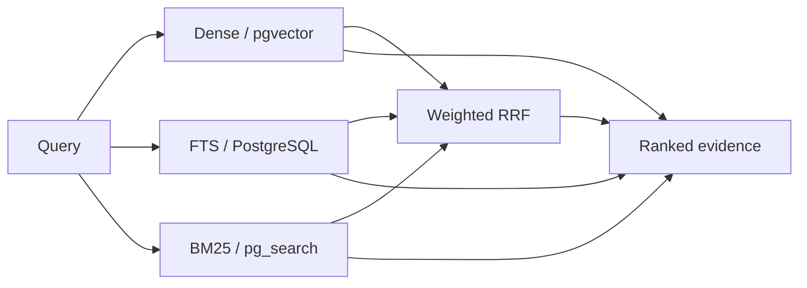

<div align="center">

# FinNexus

**Evidence-grounded financial intelligence over SEC filings.**

[](https://www.python.org/)
[](https://www.postgresql.org/)
[](https://github.com/pgvector/pgvector)
[](https://streamlit.io/)
[](https://github.com/desire-del/finnexus)

[Repository](https://github.com/desire-del/finnexus) · [Quick start](#quick-start) · [Retrieval evaluation](#retrieval-evaluation) · [Configuration](#configuration)

</div>

FinNexus is an engineering and research RAG system for SEC filings. It combines versioned filing ingestion, configurable PostgreSQL retrieval, cited generation, evaluation, and observability so retrieval changes can be measured instead of assumed to help.

```text
SEC ingestion → structured processing → PostgreSQL retrieval
              → ranked evidence → cited generation
              → evaluation and observability
```

> [!IMPORTANT]
> FinNexus is under active development. It is not production-ready and does not provide financial advice.

## What works today

- SEC filing discovery and ingestion through EdgarTools.
- Section extraction, token-aware chunking, and source provenance.
- OpenAI, Hugging Face, and Ollama embedding profiles selected through `.env`.
- Idempotent ingestion with processing-version and embedding-profile isolation.
- Dense semantic retrieval with pgvector.
- Native PostgreSQL full-text search with GIN and `ts_rank_cd`.
- PostgreSQL-native BM25 retrieval with `pg_search`.
- Dense + FTS and Dense + BM25 retrieval with weighted Reciprocal Rank Fusion.
- One configuration-driven `Retriever` shared by the application and evaluation code.
- A reusable async evaluation API with FinanceBench retrieval benchmarking.
- Structured answers with citations and navigable SEC evidence links.
- A Streamlit interface for querying, ingestion, filing inventory, sources, latency, throughput, and token usage.
- Phoenix tracing through OpenTelemetry and OpenInference.
- A dedicated ingestion CLI and FinanceBench corpus/evaluation scripts.

FinNexus currently handles one company and filing type per standard ingestion request and targets the latest matching filing. Queries are stateless. There is no FastAPI, REST, or other HTTP API layer yet; the implemented interfaces are Streamlit, command-line scripts, and the Python application layer.

## Technology

| Area | Current implementation |
|---|---|
| Runtime | Python 3.12, `uv` |
| Database | PostgreSQL 16 via ParadeDB `0.25.3-pg16`, SQLAlchemy async, asyncpg |
| Search | pgvector, PostgreSQL FTS, `pg_search` BM25, weighted RRF |
| SEC source | EdgarTools |
| RAG | LangChain Core, langchain-postgres, tiktoken |
| Embeddings | OpenAI, Hugging Face, Ollama |
| Chat models | OpenAI, Hugging Face, Ollama |
| Evaluation | FinanceBench, async evaluation API, Hit@K, Recall@K, MRR@K |
| UI | Streamlit |
| Observability | Phoenix, OpenTelemetry, OpenInference, structlog |
| Development | pytest, Ruff, Mypy |

## Retrieval architecture

FinNexus exposes one configurable `Retriever` with four modes:

- **Dense** — semantic search over pgvector embeddings.
- **FTS** — PostgreSQL-native full-text search using an English `tsvector` expression, a GIN index, and `ts_rank_cd`.
- **BM25** — PostgreSQL-native BM25 ranking backed by `pg_search`.
- **Hybrid** — dense candidates plus either FTS or BM25 candidates, fused with configurable weighted Reciprocal Rank Fusion.



Hybrid retrieval combines ranks, not raw scores: cosine similarity, FTS rank, and BM25 score are not directly comparable. Candidate depths, lexical backend, RRF constant, and branch weights are all configuration-driven.

## Retrieval evaluation

The evaluation layer runs the same production retrieval path used by the application:

```text
Dataset + RetrievalSettings + Metrics
                  ↓
          await evaluate(...)
                  ↓
          EvaluationResult
```

FinanceBench is the primary retrieval benchmark. The current baseline uses:

- 136 SEC-compatible cases from the 150-case open-source set;
- 14 unsupported cases excluded during corpus resolution;
- a frozen evidence matcher;
- evaluation at K = 1, 3, 5, 10, and 20;
- OpenAI `text-embedding-3-small` embeddings with dimension 1536.

The evaluation API is dataset-oriented and can be used from any async Python environment:

```python
from rag_sec.config import RetrievalSettings
from rag_sec.evaluation import evaluate, retrieval_metrics
from rag_sec.evaluation.datasets import FinanceBench

dataset = await FinanceBench.load()

result = await evaluate(
    dataset=dataset,
    settings=RetrievalSettings(
        mode="dense",
        top_k=20,
        dense_candidate_k=20,
    ),
    metrics=retrieval_metrics(ks=[1, 3, 5, 10, 20]),
)

print(result.summary())
```

`EvaluationResult` provides aggregate data through `summary()`, one row per case through `to_dataframe()`, and direct access to detailed per-case results. This supports analysis by question type, reasoning type, evidence count, retrieval failure, and latency. Experiments are often driven from local research notebooks, while the reusable evaluation code is part of the repository.

### FinanceBench baseline

The following completed run compares the five implemented retrieval configurations with equal 1:1 weights for both hybrid variants:

| Mode | Hit@5 | Recall@5 | MRR@5 | Hit@20 | Recall@20 | MRR@20 |
|---|---:|---:|---:|---:|---:|---:|
| Dense | **56.62%** | **50.25%** | **41.24%** | **79.41%** | **77.21%** | **43.68%** |
| FTS | 29.41% | 26.96% | 18.16% | 55.88% | 52.82% | 20.83% |
| BM25 | 39.71% | 37.50% | 26.07% | 56.62% | 53.80% | 27.62% |
| Dense + FTS | 49.26% | 45.96% | 33.97% | 77.21% | 74.39% | 37.02% |
| Dense + BM25 | 47.06% | 44.12% | 33.22% | 75.00% | 71.81% | 36.33% |

Dense retrieval is currently the strongest measured configuration. BM25 ranks evidence better than PostgreSQL FTS at early cutoffs, and both lexical branches recover some evidence missed by dense retrieval. However, the tested equal-weight hybrids lose more dense successes than they recover, so FinNexus does **not** currently claim a hybrid quality improvement. The next retrieval work is driven by persistent failure analysis and measured ranking behavior.

## Quick start

### Requirements

- Git with SSH access to GitHub
- Python 3.12+
- [`uv`](https://docs.astral.sh/uv/)
- Docker with Compose

### 1. Clone and install

```bash
git clone git@github.com:desire-del/finnexus.git
cd finnexus
uv sync --dev
```

### 2. Configure the environment

```bash
cp .env.example .env
```

Set a valid SEC identity and the credentials required by your selected providers:

```env
EDGAR_IDENTITY="Your Name your.email@example.com"
LLM_API_KEY=your_api_key
```

The default profile uses local Hugging Face embeddings and an OpenAI chat model.

### 3. Start PostgreSQL and Phoenix

```bash
docker compose up -d postgres phoenix
docker compose ps
```

| Service | Local address |
|---|---|
| PostgreSQL | `localhost:5433` |
| Phoenix UI | [http://localhost:6006](http://localhost:6006) |
| Phoenix OTLP/HTTP | `http://localhost:6006/v1/traces` |
| Phoenix OTLP/gRPC | `localhost:4317` |

Database initialization creates the `vector` and `pg_search` extensions plus the FTS and BM25 indexes used by retrieval.

### 4. Ingest a filing

```bash
# Latest 10-K for a ticker
uv run rag-sec-ingest AAPL

# Another form or a numeric CIK
uv run rag-sec-ingest AAPL --form-type 10-Q
uv run rag-sec-ingest 320193 --form-type 10-K

# Machine-readable output
uv run rag-sec-ingest AAPL --json
```

Run `uv run rag-sec-ingest --help` for chunk-size and overlap options.

### 5. Launch Streamlit

```bash
uv run streamlit run streamlit_app.py
```

Open [http://localhost:8501](http://localhost:8501). On WSL, a `gio: ... Operation not supported` message only means that the browser could not be opened automatically; the server remains available. To suppress browser launch on a headless machine:

```bash
uv run streamlit run streamlit_app.py --server.headless true
```

## Configuration

Configuration is loaded from `.env` with `pydantic-settings`.

### Embeddings

```env
# huggingface | openai | ollama
EMBEDDING_PROVIDER=huggingface

EMBEDDING_HUGGINGFACE_MODEL_NAME=sentence-transformers/all-MiniLM-L6-v2
EMBEDDING_HUGGINGFACE_DIMENSION=384

EMBEDDING_OPENAI_MODEL_NAME=text-embedding-3-small
EMBEDDING_OPENAI_DIMENSION=1536

EMBEDDING_OLLAMA_MODEL_NAME=nomic-embed-text
EMBEDDING_OLLAMA_DIMENSION=768
```

Processing versions are tied to the embedding provider, model, dimension, and processing fingerprint. After changing profiles, ingest the required filings again; retrieval intentionally excludes incompatible chunks.

### Retrieval

```env
# dense | fts | bm25 | hybrid
RETRIEVAL_MODE=hybrid
RETRIEVAL_TOP_K=5
RETRIEVAL_DENSE_CANDIDATE_K=20
RETRIEVAL_FTS_CANDIDATE_K=20
RETRIEVAL_BM25_CANDIDATE_K=20

# Used only in hybrid mode: fts | bm25
RETRIEVAL_HYBRID_LEXICAL_BACKEND=fts
RETRIEVAL_RRF_K=60
RETRIEVAL_DENSE_WEIGHT=1.0
RETRIEVAL_LEXICAL_WEIGHT=1.0
```

### Chat model

```env
# openai | huggingface | ollama
LLM_PROVIDER=openai
LLM_MODEL_NAME=gpt-4o-mini
LLM_API_KEY=your_api_key
LLM_BASE_URL=
LLM_TEMPERATURE=0.0
```

### Observability

```env
# phoenix | none
OBSERVABILITY_PROVIDER=phoenix
OBSERVABILITY_CAPTURE_CONTENT=false
PHOENIX_ENDPOINT=http://localhost:6006/v1/traces
PHOENIX_PROJECT_NAME=finexus
```

Content capture is disabled by default to avoid recording questions, answers, and filing excerpts. Set `OBSERVABILITY_PROVIDER=none` to disable tracing.

## Repository layout

Only the important tracked areas are shown:

```text
.
├── scripts/
│   ├── prepare_financebench_corpus.py  # Resolve and ingest benchmark filings
│   └── evaluate_financebench.py        # Run named retrieval configurations
├── src/rag_sec/
│   ├── application/     # Runtime, retrieval, query, and filing workflows
│   ├── cli/             # Ingestion CLI
│   ├── database/        # Async lifecycle, indexes, views, and repositories
│   ├── evaluation/      # Dataset adapters, metrics, matching, and evaluation API
│   ├── generation/      # Context construction and cited generation
│   ├── ingestion/       # SEC discovery-to-activation pipeline
│   ├── models/          # SQLAlchemy persistence models
│   ├── prompts/         # Tracked Markdown prompt resources
│   ├── providers/       # Embedding and chat-model factories
│   ├── retrieval/       # Dense, FTS, BM25, and hybrid retrieval
│   ├── schemas/         # Pydantic contracts and enums
│   ├── ui/              # Streamlit-facing application service
│   ├── config.py
│   ├── logging.py
│   └── observability.py
├── docker-compose.yml
├── main.py              # Minimal local RAG example
├── streamlit_app.py     # Streamlit entrypoint
├── pyproject.toml
└── uv.lock
```

Local research notebooks, benchmark data, experiment artifacts, and working notes are intentionally not tracked at this stage. The evaluation code is public; its local research and data layer is not.

## Current limitations

- No HTTP API, authentication, or authorization layer.
- No conversation persistence or multi-turn retrieval context.
- No query rewriter or query analyzer.
- No production reranker.
- No multi-filing, temporal, or cross-company reasoning workflow.
- No deterministic numerical calculation engine.
- No schema migration framework; initialization currently creates and adjusts database objects directly.
- No deployment or production hardening.

## Roadmap

### Foundations completed

- [x] SEC ingestion and idempotent, versioned processing
- [x] embedding-profile-aware retrieval
- [x] pgvector dense retrieval
- [x] PostgreSQL FTS and `pg_search` BM25
- [x] weighted RRF hybrid retrieval
- [x] reusable evaluation API and FinanceBench retrieval baseline
- [x] cited generation and navigable evidence
- [x] Phoenix/OpenTelemetry observability

### Retrieval intelligence

- [ ] analyze persistent retrieval failures
- [ ] add query rewriting and query understanding
- [ ] decompose multi-evidence questions
- [ ] improve section-aware and table-aware retrieval
- [ ] introduce reranking only where measured ranking failures justify it

### Financial reasoning

- [ ] support multi-filing and temporal retrieval
- [ ] add YoY/QoQ and cross-company reasoning
- [ ] add deterministic numerical QA
- [ ] evaluate answers, citations, and grounding

### Production engineering

- [ ] add an HTTP API and authentication
- [ ] introduce database migrations
- [ ] add CI/CD, deployment, and production monitoring

---

<div align="center">

**FinNexus** · Build, measure, compare, improve.

</div>
